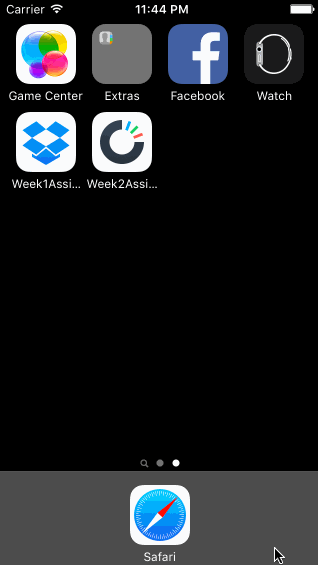

# iOS-Bootcamp-Assignment-2

This a demo app for the 2nd week of iOS Bootcamp. It includes practice with animations, alerts, and text fields. 

Time Spent: 9 hours in total

Completed User Stories

 * [x] Required: Static photos on initial screen
 * [x] Required: User can sign in with correct credentials (and get warning for wrong credentials)
 * [x] Required: User can swipe through tutorial screens
 * [x] Optional: Button fades in on last tutorial page
 * [x] Required: User can scroll image timeline
 * [x] Required: User can navigate to and from settings and conversations
 * [x] Required: User can sign out via settings screen
 * [x] Optional: User gets action sheet when trying to sign out

 

GIF created with [LiceCap](http://www.cockos.com/licecap/).
